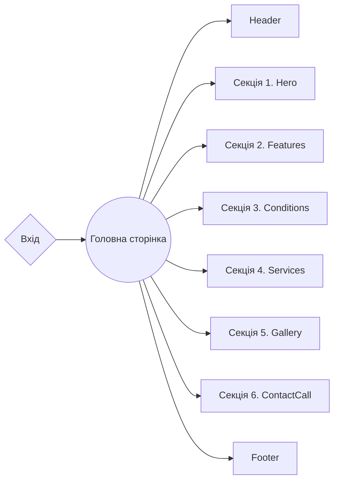

# ::cherry_blossom Flower Decor Company ::cherry_blossom

**[Переглянути живу сторінку](https://truemolni.github.io/flower-decor-company/)**

---


## Опис проєкту

- **Назва проєкту**: Flower Decor Company
- **Цілі проєкту**:
- Створення позитивного особистого бренду
- Залучення нових клієнтів / партнерів
  - Просування послуг через веб-сайт
  - Інформування споживачів
- **Цільова аудиторія**: Вік: 20-45+
- **Стать**: Жіноча/чоловіча
- **Обсяг продукту**: Розробка багатосторінкового веб-сайту для компанії "FDC",
  основна сфера діяльності якої - створення унікального та вишуканого декору для
  церемоній для святкових подій.

## 🛠️ Створення проєкту

**FDC** - це проєкт [Next.js](https://nextjs.org/) , збудований за допомогою
[Create React App](https://github.com/facebook/create-react-app).

## Особливості

- **Оптимізація**: Сайт оптимізований для швидкого завантаження, що забезпечує
  користувачам швидкий доступ до інформації.
- **Модульність та перевикористання**: Продукт побудований з використанням
  компонентного підходу, що робить код модульним і дозволяє використовувати
  компоненти на різних сторінках та розділах проєкту. Це спрощує обслуговування
  сайту та розширення його функціональності.
- **Лінтери та форматування**: Використання інструментів, таких як Prettier та
  ESLint, допомагає дотримуватися стандартів коду, забезпечує єдиний стиль та
  виявляє можливі проблеми в коді.
- **Адаптивність**: Сайт є адаптивним, що дозволяє створювати динамічні та
  інтерактивні інтерфейси користувача без перезавантаження сторінки. Це збільшує
  залучення та взаємодію користувачів.
- **Доступність**:
  - Інтуїтивний дизайн;
  - Семантична верстка;
  - Інтерфейс, зручний для мобільних пристроїв;
  - Ресурс доступний для будь-якого Інтернет-з'єднання;

### Структура проєкту

<details>

<summary><b>Організація проєкту та Розташування Файлів: </b></summary>
<br/>

```

|-- public -> статичні файли
|-- src -> директорія із вихідним кодом основної
програми
  |-- pages ->  маршрутизація
    |-- NamePage --> базові сторінки
  |-- modules -> директорія зі складними компонентами
    |-- NameComponent -> базові компоненти
    секцій/блоків (слайдер і т.д.)
  |-- shared -> невеликі, зручні компоненти
   |-- components -> невеликі, зручні компоненти
    (кнопки, логотипи і т.д.)
      |-- NameComponent -> папка для кожного компонента
        |-- NameComponent.jsx -> основний компонент
        |-- index.js -> файл для повторного
        експорту
        |-- name-component.module.css -> файл для мудульних стилів компонента
    |-- data -> статичні дані для проєкту (json/js)
    |-- hooks -> кастомні хуки
    |-- images ->
    директорія з фотографіями проєкту
    |-- css -> директорія з стилями проєкту

```

</details>

## 🧩 Технології

### Frontend

- **React**: для розробки реактивних веб-сайтів та застосунків.

### Стилізація

- **CSS modules**: Утиліта для забезпечення унікальних імен класів в CSS.

### Бібліотеки

- **Swiper**: Сучасна бібліотека для роботи зі слайдерами та каруселями.
- **GSAP**: Бібліотека для відтворення плавних стлів при скролі до розділів
  сайту.

### Структура проєкту



## 📂 Деплоймент

Для розгортання цього проєкту слід виконати наступні кроки:

1. **Клонуйте репозиторій**: Використовуйте команду `git clone`, щоб склонувати
   цей репозиторій на свій комп'ютер.
2. **Встановіть залежності**: Відкрийте термінал у кореневій папці проєкту та
   запустіть команду `npm install` або `yarn install`, щоб встановити всі
   необхідні залежності.
3. **Запустіть застосунок**: Запустіть команду `npm run dev` або `yarn dev`, щоб
   запустити проєкт на локальному сервері.
4. **Розгортання**: Для розгортання цього проєкту на виробничому сервері
   використовуйте платформи хостингу, такі як Vercel, Netlify або інші.
